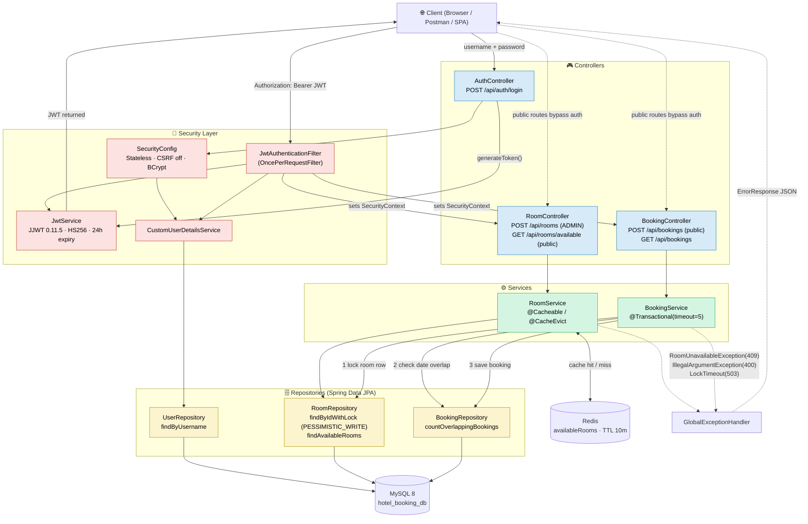

# High-Performance Hotel Booking API


An enterprise-grade, highly concurrent REST API for hotel room management and reservations. Engineered with a focus on **strict transactional integrity**, **stateless security**, and **extreme read-heavy performance optimization**. 

By integrating a Redis caching layer, the architecture successfully sustained over 1.3 million requests during 15-minute endurance soak tests with a 95th percentile latency of 32ms. Building on this, the system processes complex mixed-traffic workloads—exceeding 20,000 requests—with sub-10ms(~8.8 ms) read latencies, while mathematically eliminating double-booking race conditions through strict ACID-compliant database locking during high-concurrency spikes."

---

##  System Architecture


---

<div align="center">
    
</div>


### Core Architectural Choices:

1. **Cache-Aside Pattern (Redis):** Implemented to intercept read-heavy operations (`GET /api/rooms/available`). Offloads repetitive querying from the primary MySQL database, dramatically reducing latency.
2. **Stateless Authentication (JWT):** Utilizes Spring Security with a custom `JwtAuthenticationFilter` placed before standard Spring filters to ensure zero session overhead on the server, allowing horizontal scalability.
3. **Pessimistic Locking / ACID Transactions:** Booking writes (`POST /api/bookings`) are strictly handled to prevent race conditions using `PESSIMISTIC_WRITE` locks in the Repository layer. Conflicts are safely rejected with HTTP 409, maintaining 100% database integrity under massive concurrent load.

---
##  API Documentation (Swagger UI)

This project utilizes SpringDoc OpenAPI for interactive API documentation. Once the application is running, you can explore the endpoints, view request/response schemas, and inject your JWT token to test secured routes directly from your browser.

* **Swagger UI:** `http://localhost:8080/swagger-ui.html`
* **OpenAPI JSON:** `http://localhost:8080/v3/api-docs`

**To test secured endpoints in Swagger:**
1. Hit the `POST /api/auth/login` endpoint with the Admin credentials.
2. Copy the returned JWT string.
3. Click the **"Authorize"** button at the top of the Swagger UI.
4. Paste your token (the UI is configured to automatically append `Bearer ` if configured in your OpenAPI config, otherwise paste `Bearer YOUR_TOKEN`).

 ---
 
##  Performance Engineering & Benchmarks

To mathematically prove system scalability, the API was subjected to rigorous industry-standard performance testing using **Apache JMeter** (executed in CLI non-GUI mode to eliminate client-side bottlenecks).

### 1. Endurance/Soak Test (6,000 Sustained Load - 15 Minutes):
Maintained **6,000 concurrent users** over a 15-minute window, generating a massive **1,327,105 requests**. The system successfully processed over 1.27 million requests with a blazing-fast average response time of **5.86 ms** and a 95th percentile latency of just **13.00 ms**. A minor 4.18% connection refusal rate established the absolute upper boundary of the default Tomcat connection pool, proving the application degrades gracefully under extreme concurrency without suffering memory leaks or total failure.

<div align="center">


| Hits Per Second (Throughput) | Response Times Over Time (Latency) |
| :--- | :--- |
|  |  |

</div>


### 2. Real-World Mixed Traffic Simulation (The E-Commerce Funnel)

<div align="center">

</div>


Simulated a peak holiday booking rush: **1,000 concurrent users** generating **20,000 requests** over 60 seconds with uniform random "think time" timers (1-4s). Traffic split was **80% Searches (Reads) and 20% Bookings (Writes)** using parameterized randomized CSV data.

| Metric | Target / Result | Analysis |
| --- | --- | --- |
| **Total Requests** | 20,000 | Successfully processed massive sustained load. |
| **Read (GET) Latency (p95)** | **17.00 ms** | Redis caching ensured 95% of users experienced sub-20ms load times during heavy concurrent writes. |
| **Read (GET) Error Rate** | **0.00%** | Flawless execution on the search endpoint under load. |
| **Write (POST) Integrity** | 3,680 Overlaps Blocked (92%) | Out of 4,000 booking attempts on 60 rooms, the system correctly identified overlapping race conditions, returning `409 Conflict` safely without a single `500 Server Error` or double-booking. |

### 3. The Baseline & Caching Impact (Read-Only Comparison)

Tested the `/api/rooms/available` endpoint purely to measure the delta between a Cache-Miss (MySQL) and a Cache-Hit (Redis).

* **1,000 Requests (Cache-Hit):** * Average Response: **7.72 ms**
* Error Rate: **0.00%**

<div align="center">

</div>


* **Comparison:** While a 1,000 user sustained load purely reading from Redis returned a 99th percentile response of 70ms, introducing 4,000 concurrent writes alongside 16,000 reads only increased the read 99th percentile slightly to 91ms, proving the caching layer effectively isolates read performance from write-heavy database locks.

### 4. Spike & Stress Testing Limits

Pushed the system to its breaking point to identify hardware/configuration limits.

* **Stress Test (3,000 Sustained Load):** Successfully handled **3,000 concurrent users** generating exactly **36,000 requests** over a 3-minute ramp-up window. The system maintained a flawless **0.00% error rate** with a 95th percentile latency of **5.00 ms** and a 99th percentile of just **6.00 ms**.
<div align="center">

</div>

* **Flash-Sale Spike (500-1000 Instant Users):** Identified system limits at massive instantaneous spikes i.e  500  and 1000 requests in a single second. Error rates spiked to 25% & 75% respectively due to `HttpHostConnectException` as Tomcat max-connections/HikariCP pool limits were exceeded. This provided baseline data for future API Gateway rate-limiting (e.g., Resilience4j) and horizontal scaling requirements.

* 500 instant users
<div align="center">

</div>

* 1000 instant users
<div align="center">

</div>

---

##  Key Features & Architectural Highlights

* **High-Performance Caching (Redis):** Integrated a Cache-Aside pattern for read-heavy search operations (`GET /api/rooms/available`). This intercepts repetitive database queries, dropping read latencies to sub-10ms and drastically reducing MySQL load.
* **Concurrency Control & Double-Booking Prevention:** Implemented strict ACID-compliant transactions using `PESSIMISTIC_WRITE` row-level database locking. The system mathematically eliminates race conditions during traffic spikes, safely rejecting overlapping bookings with a `409 Conflict` rather than throwing server errors.
* **Stateless Security (JWT):** Engineered a custom Spring Security filter chain utilizing JSON Web Tokens. By eliminating server-side sessions, the API is completely stateless, highly secure, and optimized for horizontal scaling.
* **Role-Based Access Control (RBAC):** Enforced distinct permission boundaries, separating `ADMIN` privileges (room creation and system management) from standard `USER` traffic (searching and booking).
* **Dynamic & Validated Search:** Queries available rooms by parsing precise `LocalDate` parameters. Enforces strict DTO validation (e.g., `@FutureOrPresent`, `@NotNull`) to sanitize and verify inputs before they ever reach the service layer.
* **Global Exception Handling:** A centralized `@ControllerAdvice` intercepts internal Java exceptions (e.g., Redis Serialization errors, Lock Timeouts, JWT Expirations) and gracefully maps them to clean, standardized JSON `ErrorResponse` payloads for the client.
* **Automated Database Seeding:** Utilized Spring's `CommandLineRunner` to auto-initialize the MySQL database upon deployment, generating 60 distinct rooms (Standard, Deluxe, Suites) and a default Admin account for immediate testing.

---

##  Tech Stack

* **Backend Core:** Java 26, Spring Boot 4.1.0
* **Security:** Spring Security, JSON Web Tokens (io.jsonwebtoken)
* **Persistence:** Spring Data JPA, Hibernate, MySQL 8
* **Caching:** Spring Data Redis, Redis Server
* **Performance Testing:** Apache JMeter 5.6
* **Deployment (Upcoming):** Docker, Docker Compose

---

## Prerequisites

Before running this project locally, ensure you have the following installed:
* **Java 26** (JDK)
* **Maven 3.8+**
* **Docker & Docker Compose** (For Redis and MySQL containers)

##  Environment Variables
To run this application, you must configure the following properties in your `src/main/resources/application.properties` (or provide them via a `.env` file when using Docker). 

```properties
# Database Configuration
spring.datasource.url=jdbc:mysql://localhost:3306/hotel_booking_db
spring.datasource.username=YOUR_DB_USERNAME
spring.datasource.password=YOUR_DB_PASSWORD

# Redis Configuration
spring.data.redis.host=localhost
spring.data.redis.port=6379

# JWT Security
# Must be a 256-bit (32 byte) Base64 encoded string
jwt.secret=YOUR_SUPER_SECRET_BASE64_KEY_HERE
jwt.expiration=86400000
```
---
## Local Setup & Deployment (Docker)

*Configuration for Docker-Compose will be added here once local development environment variables are sanitized.*
<div align="center">

</div>

```bash
# Clone the repository
git clone [https://github.com/Asmit159/hotel-booking-api.git](https://github.com/Asmit159/hotel-booking-api.git)

# Navigate to project
cd hotel-booking-api

# Build and run with Docker Compose (MySQL, Redis, and Spring Boot)
docker-compose up --build -d

```
